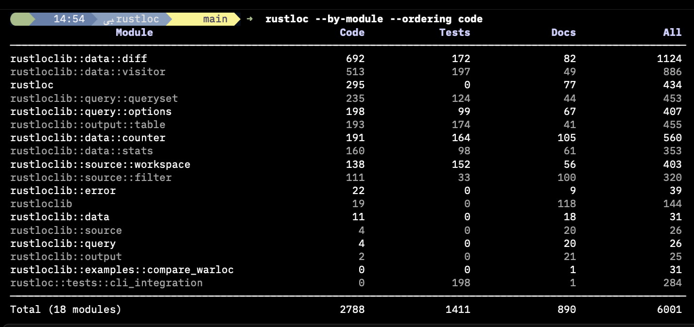
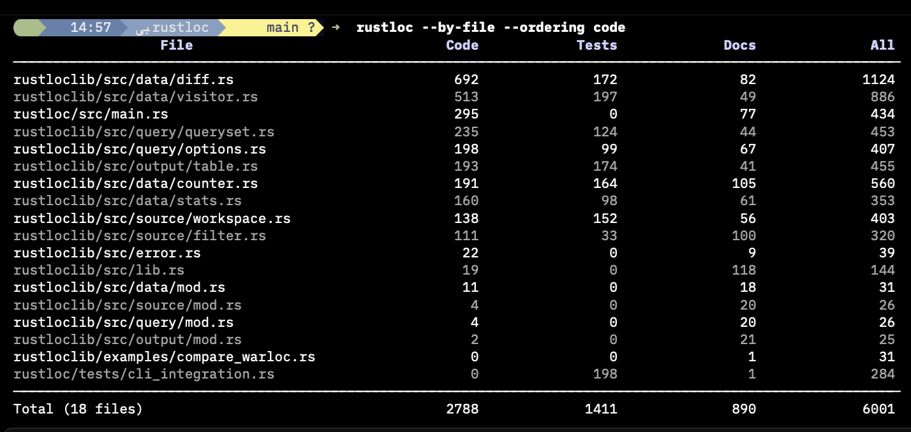
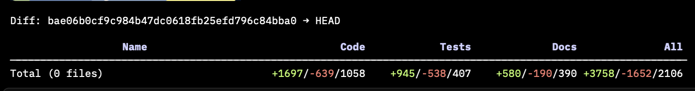

# rustloc

A Rust-aware lines-of-code counter. Unlike generic LOC tools, rustloc understands that Rust tests live alongside production code and correctly separates them — even in the same file.

[](https://github.com/arthur-debert/rustloc/actions/workflows/ci.yml)
[](https://crates.io/crates/rustloc)
[](https://opensource.org/licenses/MIT)



## Features

**Line types:** Code, Tests, Examples, Docs, Comments, Blanks

**Grouping:** by Crate, Module, or File

**Diffs:** between any two commits, HEAD, or the current working tree

**Output:** terminal tables, JSON, CSV, YAML, XML

## Installation

From crates.io:

```bash
cargo install rustloc
```

Or grab a pre-built binary from [GitHub Releases](https://github.com/arthur-debert/rustloc/releases).

## Usage

### Counting

```bash
rustloc                              # current directory totals
rustloc --by-crate                   # breakdown by crate
rustloc --by-module                  # breakdown by module
rustloc --by-file                    # breakdown by file
rustloc --type code,tests            # show only specific line types
rustloc --crate my-lib               # filter to a specific crate
rustloc --exclude "**/generated/**"  # exclude by glob
```

`--by-module`:


`--by-file`:



### Diffs

```bash
rustloc diff                         # working tree vs last commit
rustloc diff HEAD~5..HEAD            # between any two commits
rustloc diff main..feature --by-file # per-file diff breakdown
rustloc diff --staged                # staged changes only
```



### Output formats

```bash
rustloc --output json
rustloc --output csv
rustloc --output yaml
rustloc --output-file-path report.csv --output csv
```

## Library

rustloc is also available as a library crate (`rustloclib`). See the [API documentation](https://docs.rs/rustloclib).

## How it works

rustloc uses a token-based parser with single-character lookahead to analyze Rust source files. It recognizes:

- Test blocks via `#[test]` and `#[cfg(test)]` attributes
- File context from paths (`tests/`, `examples/` directories)
- All Rust comment styles including doc comments
- Raw string literals that may contain comment-like syntax
- Nested block comments

The parsing logic is adapted from [cargo-warloc](https://github.com/Maximkaaa/cargo-warloc) by Maxim Gritsenko.

## License

MIT License — see [LICENSE](LICENSE) for details.
